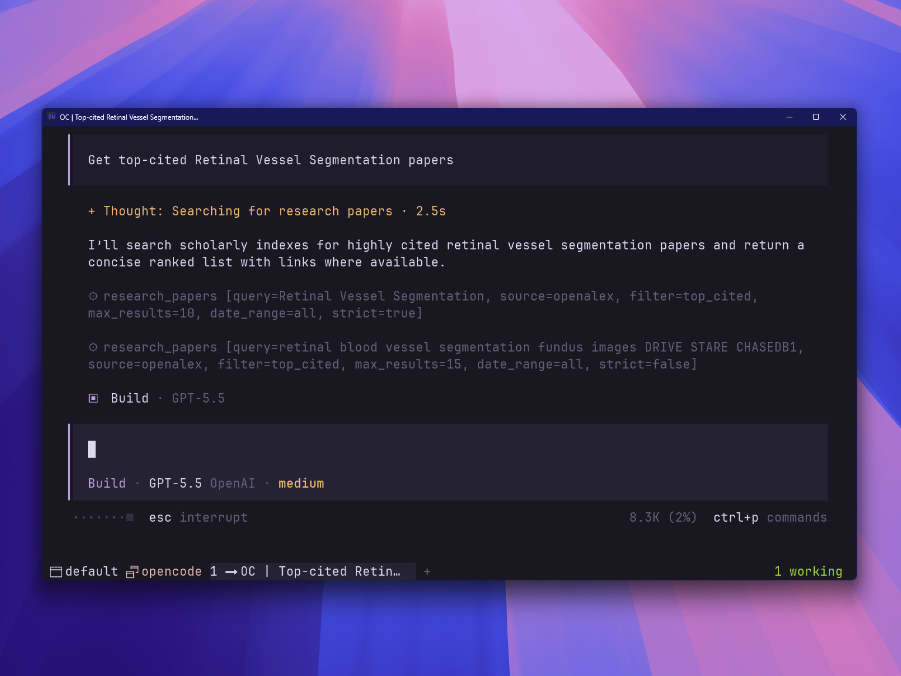

# opencode-research-papers-plus

[](https://opencode.ai/docs/plugins/)
[](https://github.com/johnhtay/opencode-research-papers-plus/actions/workflows/ci.yml)
[](./LICENSE)



An [opencode](https://opencode.ai) plugin that adds a `research_papers` tool. This is an AI-facing tool, not a slash command — ask the AI to search for papers and it will call the tool for you.

This is a fork of [opencode-research-papers](https://github.com/saim-x/opencode-research-papers) by [saim-x](https://github.com/saim-x), extended with bioRxiv/medRxiv preprints and PubMed biomedical literature. See [Credits](#credits).

Clone. Build. Point your config at `dist/index.js`. Restart. Ask for papers.

> **Not on npm yet.** This package is **not published to the npm registry**. Until it is, install it locally via a `file://` plugin entry (below). Do **not** put the bare name `"opencode-research-papers-plus"` in your `plugin` array — opencode will try to install it from npm, receive a 404, and fail silently: the `research_papers` tool simply never appears. See [Troubleshooting](#troubleshooting).

## Features

- No API keys required. Uses arXiv for fresh CS/physics preprints, OpenAlex for broader scholarly metadata, bioRxiv for biology/health preprints, and PubMed for biomedical literature.
- Smart `auto` source routing — arXiv + OpenAlex + PubMed for `latest`, OpenAlex + PubMed for `top_cited` and `trending`.
- Markdown output with title, authors, date, journal, DOI, PMID, PDF link, abstract, and citation count where available.
- Filter by recency (`latest`, `trending`) or citation impact (`top_cited`).
- Narrow results to the past week, month, or year.
- `strict` mode applies anchor + concept-group filtering to reduce loosely matched results.
- Source-level fallback: if one source fails or is rate-limited, the others handle the request transparently.
- arXiv requests are spaced 3 seconds apart per arXiv's public API terms; NCBI E-utilities (PubMed) requests are spaced to respect the 3 req/s limit.

## Installation

Local build only for now (npm release pending). Requires [Bun](https://bun.sh) — the same runtime opencode uses; no Node.js or npm is needed.

### 1. Clone and build

```bash
git clone https://github.com/johnhtay/opencode-research-papers-plus.git
cd opencode-research-papers-plus
bun install     # installs fast-xml-parser + @opencode-ai/plugin into ./node_modules
bun run build   # compiles src/ → dist/ (tsc)
```

Keep the clone intact: at load time the plugin imports `fast-xml-parser` and `@opencode-ai/plugin` from the repo's own `node_modules/`, so don't move or delete it.

### 2. Register the plugin in your opencode config

Add a `file://` entry with an **absolute** path to the built entry point, in either your global config (`~/.config/opencode/opencode.json` or `opencode.jsonc`) or a project-level `opencode.json`:

```jsonc
{
  "$schema": "https://opencode.ai/config.json",
  "plugin": [
    "file:///absolute/path/to/opencode-research-papers-plus/dist/index.js"
  ]
}
```

opencode imports `file://` entries directly from disk at startup — no registry, no cache step.

### 3. Restart opencode

Config and plugins are only read at startup, so quit and relaunch. Then ask for papers.

## Updating

A `file://` plugin is loaded fresh from disk on every start, so there is no cache to clear:

1. `git pull` in the repo (or edit locally)
2. `bun run build`
3. Restart opencode

## Installing from npm (once published)

Once this package is published to the npm registry, the entry simplifies to the package name:

```json
{
  "plugin": ["opencode-research-papers-plus"]
}
```

opencode installs npm-spec plugins automatically with Bun at startup and caches them under `~/.cache/opencode/packages/<name>@<version>`. Cached plugin packages do **not** auto-update on restart, so after publishing/updating to a new version, clear the cache before restarting:

**Windows (PowerShell):**
```powershell
Remove-Item -Recurse -Force "$env:USERPROFILE\.cache\opencode\packages\opencode-research-papers-plus@latest"
```

**macOS / Linux:**
```bash
rm -rf ~/.cache/opencode/packages/opencode-research-papers-plus@latest
```

Then restart opencode.

## Troubleshooting

- **`research_papers` tool doesn't appear.** If your config lists the bare package name while the package is unpublished, opencode's npm plugin loader creates `~/.cache/opencode/packages/opencode-research-papers-plus@latest`, runs `bun add opencode-research-papers-plus` inside it, gets a 404 from the registry, and leaves the directory empty — plugin loading fails silently. Remove the stale empty directory, use the `file://` entry above, and restart.
- **Don't `bun add` the local path into `~/.config/opencode`.** opencode manages that directory itself and runs `bun install` there at startup, re-syncing `package.json`/`node_modules`. A manually added local-path dependency gets pruned and the plugin disappears on the next restart (this exact failure was observed in practice). The `file://` config entry is the reliable local mechanism; it bypasses npm resolution entirely.
- **Verify the entry point loads** (outside opencode):
  ```bash
  bun -e "import('file:///absolute/path/to/opencode-research-papers-plus/dist/index.js').then(async m => console.log(Object.keys(await m.default({}, {}) ?? {})))"
  # → [ 'tool' ]  (the `research_papers` tool lives inside)
  ```
- **Environment variables.** Inside opencode, plugin processes see `OPENCODE=1` and `OPENCODE_PID`. Config file locations can be overridden with `OPENCODE_CONFIG` (single file) and `OPENCODE_CONFIG_DIR` (directory with agents/commands/plugins), and config values support `{env:VAR}` substitution. See the [config docs](https://opencode.ai/docs/config/).
- **Bun-only environments.** On machines without Node.js/npm in `PATH`, use `bun run build`, `bun run typecheck` (`tsc --noEmit`), and `bun run test` (vitest) — they all resolve the local toolchain from `node_modules/.bin`.

## Usage

This is an AI tool — you do not invoke it with a slash command. Ask naturally:

> "Find the latest papers on Image Segmentation"

> "Show me trending Scene Text Recognition papers"

> "Get top-cited Retinal Vessel Segmentation papers"

> "Find 20 latest papers on Generative Adversarial Networks from the last month"

> "Find recent bioRxiv preprints on SARS-CoV-2 evolution"

> "Search PubMed for the latest papers on CRISPR base editing"

## Configuration

Plugin options are passed as a tuple — the second element is the options object (same form for an npm package name once published):

```jsonc
["file:///absolute/path/to/opencode-research-papers-plus/dist/index.js", {
  "defaultMaxResults": 15,
  "defaultSource": "auto",
  "pubmedEmail": "you@example.com"
}]
```

| Option | Default | Description |
|--------|---------|-------------|
| `defaultMaxResults` | `10` | How many results to return (1–50) |
| `defaultSource` | `"auto"` | Source routing: `auto`, `arxiv`, `openalex`, `biorxiv`, or `pubmed` |
| `pubmedEmail` | — | Optional contact email sent to NCBI E-utilities as client identification |

### Source routing

The `auto` default selects the primary sources per filter:

| Filter | Sources (in merge priority order) |
|--------|-----------------------------------|
| `latest` | arXiv → OpenAlex → PubMed |
| `top_cited` | OpenAlex → PubMed |
| `trending` | OpenAlex → PubMed |

Override with `source: "arxiv"`, `"openalex"`, `"biorxiv"`, or `"pubmed"` to use a single source. `biorxiv` is only available via explicit selection — use it for biology and health-science preprint searches.

## Data Sources

### arXiv

Provides fresh preprints across AI, CS, math, and physics. Delivers direct PDF links and clean metadata. No signup required. Requests are rate-limited to one per 3 seconds per arXiv's public API terms.

### OpenAlex

Broader scholarly search with citation counts, DOI metadata, and open-access links. Works without an API key at 10 requests per second.

### bioRxiv (and medRxiv)

Biology and health-science preprints from Cold Spring Harbor's servers. Implemented on top of OpenAlex, restricted to the bioRxiv and medRxiv repositories, so keyword search, abstracts, and citation counts all work. Results from medRxiv are labeled `medRxiv`; everything else is labeled `bioRxiv`.

### PubMed

Biomedical literature via NCBI's E-utilities (ESearch + EFetch). Supports keyword search with native date filtering. Citation counts are not available from PubMed, so `top_cited` and `trending` fall back to relevance sorting. PDF links resolve to PubMed Central when available, otherwise the DOI. Requests are throttled to respect NCBI's 3 requests/second guideline.

## Error Handling

If one source is down or rate-limited, the plugin returns the remaining sources' results with the specific error noted. If all requested sources fail, you receive a consolidated error message. The tool does not crash.

## Credits

This project is a fork of [opencode-research-papers](https://github.com/saim-x/opencode-research-papers) by [Muhammad Saim](https://github.com/saim-x), which provides the core `research_papers` tool, the arXiv and OpenAlex integrations, auto source routing, strict-mode filtering, and the release tooling. Many thanks for the solid foundation.

This fork adds:

- **bioRxiv and medRxiv preprints** — OpenAlex-backed search restricted to the Cold Spring Harbor preprint servers
- **PubMed** — biomedical literature via NCBI E-utilities (ESearch + EFetch)
- N-source routing with per-source error isolation, DOI-first cross-source deduplication
- Journal, DOI, and PMID fields in results, with an optional `pubmedEmail` for NCBI client identification

Both projects are MIT-licensed.

## License

MIT — see [LICENSE](./LICENSE). Original work Copyright (c) 2026 Muhammad Saim. Fork modifications Copyright (c) 2026 John H. Tay.

## Roadmap

Potential future additions:

- **npm release** — publish to the registry so the plain `"plugin": ["opencode-research-papers-plus"]` entry works everywhere.
- **GitHub paper-list repos** — Search curated repository lists (e.g. `scene-text-detection-recognition-papers`) alongside paper results.
- **Citation counts for PubMed** — Cross-reference PubMed results with OpenAlex via batch DOI lookup to enrich citation data and support `top_cited`.
- **Native bioRxiv mode** — Direct api.biorxiv.org queries for freshest preprints (the official API lacks keyword search, so this would be date-window based with local filtering).
- **Better deduplication** — Title normalization is a rough heuristic; smarter deduplication could avoid showing the same paper twice.
- **Synonym expansion** — Expand common terms in strict mode (e.g. GAN → cGAN, WGAN, StyleGAN) to improve recall.
- **Semantic strict mode** — Use embeddings or cross-encoder reranking instead of keyword matching for relevance filtering.
- **Citation counts for arXiv papers** — Cross-reference arXiv results with OpenAlex to retrieve citation data.
